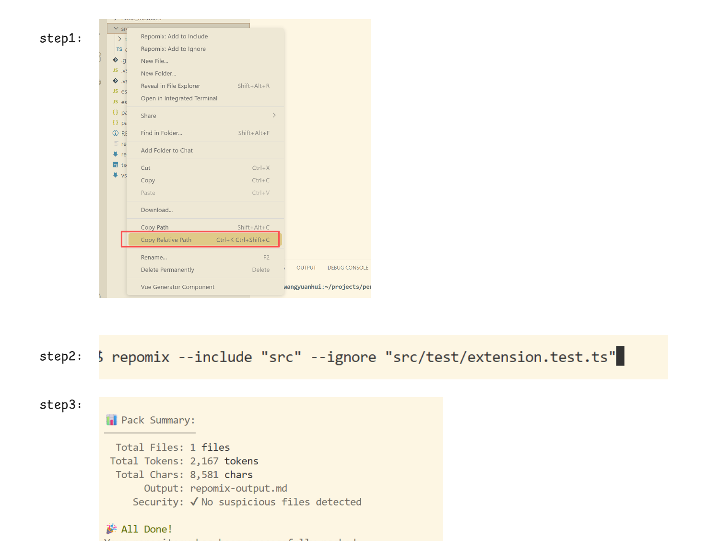
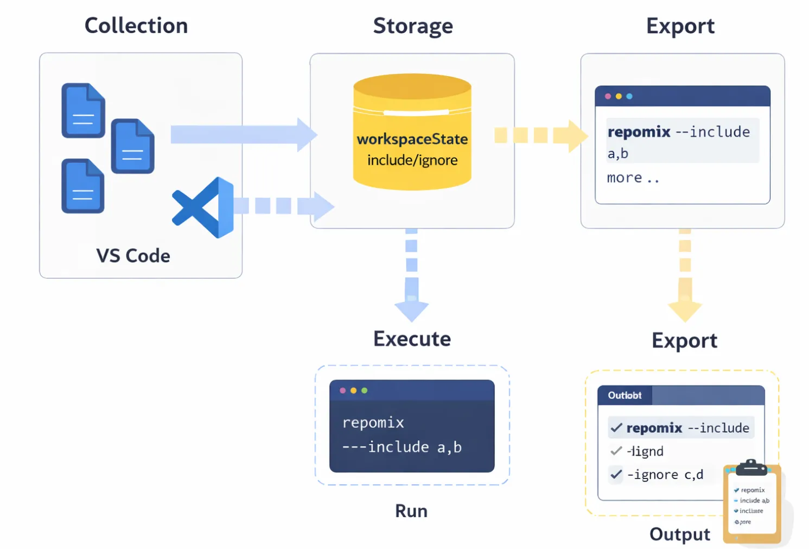
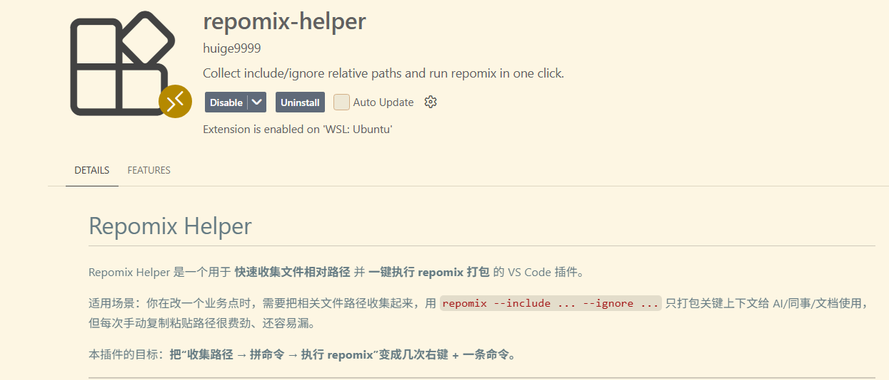

# repomix-helper：把 repomix 变成 VS Code 一键工作流

这是一篇“解决真实摩擦”的小项目复盘：我把 repomix 的高频手工流程塞进 VS Code，目标是**不离开编辑器就能完成收集、打包、交付**。

## 背景：痛点到底是什么

我日常会把业务相关代码打包成“最小上下文”，丢给网页端 LLM 做分析/建议/重构。原流程是：

- 在 VS Code 里找文件
- 复制一堆相对路径，手工拼 `repomix` 命令
- 执行命令生成 `repomix.output.md`
- 再切到文件管理器，把产物拖/复制给 LLM

问题不在于“做不到”，而在于：

- 路径收集机械、容易漏、容易拼错
- 命令容易出现引号/重复/相对路径错误
- 工作节奏被频繁打断
- 每次都要“确认我拼对了没”

我想要的不是“更熟的命令”，而是**把这段机械劳动工具化**。

## 目标：省掉 80% 的麻烦

我给插件定了明确的验收标准：

- 在 VS Code 内完成路径收集（不离开编辑器）
- include/ignore 可累积、去重、清空
- 一键执行 repomix
- 能导出完整命令（形成可复用资产）
- 产物一键交付给 LLM（不切到系统文件管理器）

## 为什么是 VS Code 插件，而不是脚本

脚本能跑通流程，但拿不到 IDE 上下文：

- 右键选中的文件脚本不知道
- 状态栏按钮、资源管理器菜单、输出面板这些交互是 VS Code 原生优势

所以最终选择：**用插件把流程原子化并嵌入编辑器**。

## 核心设计

### 1) 数据存储：workspaceState

不引入额外配置文件，避免同步/冲突/清理成本：

- 轻量
- 每个工作区独立
- 不落盘（可接受不跨机同步）

### 2) 路径统一为工作区相对路径

- `workspaceFolder + path.relative`
- 分隔符统一成 `/`，避免跨系统兼容问题

### 3) 执行方式：VS Code Task

- 输出在 terminal/task 面板
- 不用自己管理 `child_process`
- 更像“开发工具”而非“脚本工具”

### 4) 导出命令：让一次收集变成资产

我希望“收集一次 → 反复复用”：

- 执行 repomix：把参数传给 Task
- 导出命令：拼成字符串输出到 Output

## 关键实现点（只讲三件）

### 1) 多选右键如何拿到全部文件

右键触发命令时：

- `uri`：当前右键的文件
- `uris`：所有选中的文件（多选时有）

处理逻辑：

- 有 `uris` 就用 `uris`
- 否则用 `uri`
- 再退化为当前 `active editor`

### 2) 相对路径计算与分隔符统一

必须基于 `workspaceFolder` 计算相对路径，然后转为 `/`：

- 命令才稳定可复制
- WSL/Windows/macOS 都能用

### 3) 执行 vs 导出共享同一套拼参逻辑

把参数拼接当作“单一事实来源”：

- 运行时传给 Task
- 导出时输出成命令字符串

并遵循“有就输出，没有就不带”的策略，命令更干净。

## 最后一公里：把产物交付留在 VS Code 内

`repomix` 生成 `repomix.output.md` 后，常见动作是“打开文件管理器 → 复制文件”。

我把这一步也收进插件：**一键复制当前文件到剪贴板**。

关键点：

- `activeTextEditor.document.uri.fsPath` 获取真实路径
- WSL 环境用 `wslpath -w` 转 Windows 路径
- PowerShell `Set-Clipboard -LiteralPath` 复制实体文件

最终效果：生成产物 → 打开文件 → 右键复制 → 直接粘贴到浏览器/聊天工具。

## 功能演进（简表）

- 0.0.1：能跑通闭环（收集、执行、清空）
- 0.1.0：更顺手（状态栏按钮、多选收集）
- 0.2.0：可复用（导出完整命令）
- 0.3.0：闭环交付（一键复制文件到剪贴板）

## 使用方式（最短路径）

1) 多选文件 → 右键 Add to Include / Ignore
2) 状态栏点击 Run（或命令 Repomix: Export）
3) 打包完成后打开 `repomix.output.md`
4) 右键 Repomix: Copy Current File to Clipboard

## 结果：它帮我省了什么

- 时间：从 1~3 分钟降到十几秒
- 摩擦：减少“拼命令 + 反复确认”的脑力浪费
- 行为：更愿意高频给 LLM 提供高质量上下文

## 后续规划（小而美）

- 冲突提示：同一路径同时出现在 include/ignore 时给提示
- Export 增强：同时输出逐行 include/ignore 列表
- Preset：保存多套路径预设（登录链路/支付链路等）

## 结语

工具化本质上是架构能力的一部分：**让高频动作更便宜、更可靠、更可复用**。

repomix-helper 对我来说不是“造轮子”，而是让一个已证明有效的工作流真正顺滑起来。顺滑了，思考就会变多，机械劳动就会变少。

## 项目地址

- Repo：<https://github.com/huige9999/repomix-helper/tree/v0.3.0>
- Release：<https://github.com/huige9999/repomix-helper/releases/tag/v0.3.0>

