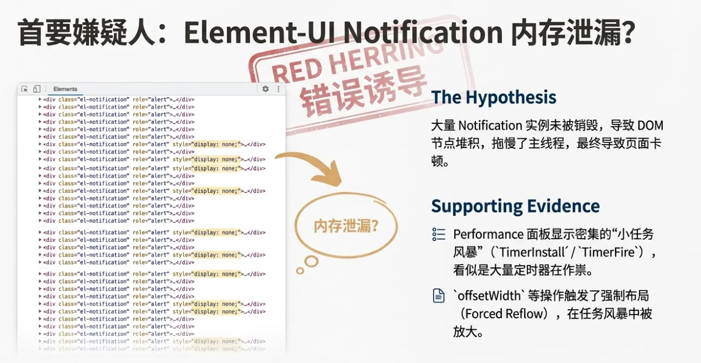
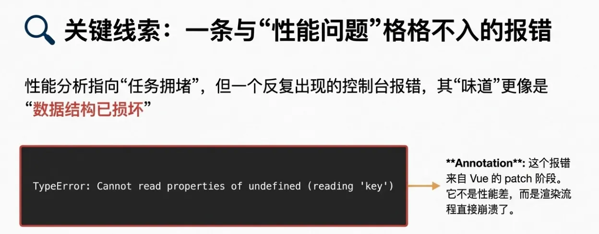
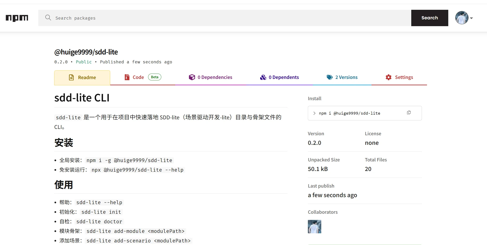
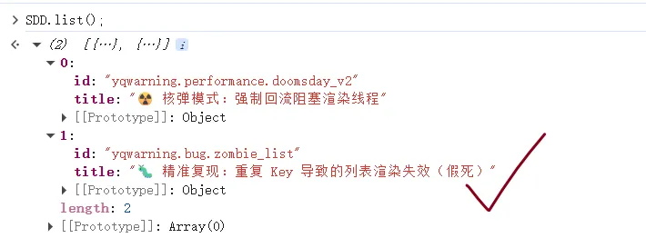

# 重复 key 触发 Vue patch 崩溃：一次前端“假死”排查

这次问题看起来像内存泄漏，最终却指向一个更隐蔽的根因：**列表 key 重复导致 Vue patch 中断**。下面是完整的排查与修复路径。

## 背景：客户说“点击失效”，但系统并未停转

线上客户反馈一个非常诡异的现象：页面放着不动一段时间后，点击按钮没有 active/unactive 反馈，看起来“点击失效”。但同时又有一组与之矛盾的事实：

- hover 正常
- 点击触发的请求仍然正常发送/完成
- 页面还能滚动
- 未读消息数（铃铛）稳定增长
- DevTools Elements 出现大量 `.el-notification` 节点，其中不少是 `display: none`

第一直觉非常像：**Notification 没销毁，内存泄漏把页面拖死了**。

## 先澄清：为什么“请求能发、滚动能滚、但 UI 不更新”不矛盾

这类现象的关键在于：**请求、滚动、UI 更新是不同链路**。

- 请求能发：点击回调把请求交给浏览器网络栈后，就算主线程变慢，请求依然能发送与返回。
- 滚动还能滚：很多滚动在合成线程执行，或只是“能滚但掉帧”。
- UI 不更新：这是 Vue 响应式更新 → VDOM diff → patch → DOM 更新的链路。一旦 patch 抛错，UI 会出现“假死”。

所以，“逻辑在跑、UI 不更新”并不矛盾，它更像 **渲染链路被中断**。

## 初步怀疑：Notification 泄漏 + 小任务风暴

我抓了 Performance，没看到“爆红的长任务”，但出现了明显的“小任务风暴”：

- `TimerInstall` / `TimerFire` 非常密集（大量 0ms timer）
- 全局 click handler（如 ElementUI 的 `handleDocumentClick`）异常活跃
- `offsetWidth` 等布局读取放大了 reflow 影响

这条线索可以解释“内存不大但页面卡”的情况，**但还不够解释 UI 假死**。


## 关键线索：Vue patch 报错

Console 偶发出现：

```text
TypeError: Cannot read properties of undefined (reading 'key')
```

这不像性能问题，更像**渲染数据结构被破坏**。它把排查方向从“性能”拉回到“渲染一致性”。


## 可控复现：用 ssd-lite 还原问题

为了从复杂业务中抽离，我用 ssd-lite 写了一个最小复现脚手架，覆盖了：正常流、消息洪峰、滴灌、切后台、重连，以及**重复 uniqueId**。

结果非常清晰：

- 列表 key 使用 `:key="uniqueId"`
- 持续喂入 **重复 uniqueId**


即可稳定复现：**UI 更新崩坏 / 点击状态不刷新 / 请求与滚动仍 OK**。

```vue
<div v-for="msg in list" :key="msg.uniqueId">
  <!-- ... -->
</div>
```

这意味着我不再需要猜“是不是 Notification 的锅”。**只靠重复 key 就能让 Vue patch 失控**。

## 根因机制：重复 key 让 diff/patch 自相矛盾

Vue（以及大多数 VDOM 框架）依赖 key 做“节点身份识别”。当 key 重复时：

- diff 映射表（key → vnode）会覆盖或错配
- patch 过程拿到错误的 vnode/elm
- 运行期抛错，导致更新中断

一旦更新中断，后续更新也可能持续失败，最终就会出现“逻辑在跑，但 UI 不再刷新”。

## Notification 为什么会堆积？

Notification 堆积是真实的，但在这次事故里更像**症状放大器**：

- patch 链路异常后，销毁回调可能不再可靠
- 逻辑继续创建通知，但视图与卸载不再一致

最终表现就像“泄漏”，但它不是根因。

## 修复策略：源头修复 + 前端兜底

### 1) 源头修复（服务端）

- 保证 uniqueId **在同一消息流/列表维度内唯一**
- 如果是重放/补发，必须使用**稳定一致的 id**

### 2) 前端兜底（防御性编码）

- 列表 key 不直接使用不可信的 uniqueId
- 更稳的 key 顺序建议：
  - `messageId`（真正每条消息唯一）
  - 服务端保证唯一的 id
  - 兜底：本地生成 `clientId`（接收时生成并缓存）
- 对重复 uniqueId 做去重/合并（保留最新或合并计数）
- 加断言与告警：
  - `console.error` 输出冲突样本
  - 上报监控（Sentry/自研日志）
  - 开发环境可直接 `throw`

### 3) 通知系统修复继续保留

之前那套 Notification 单例竞态修复（回调只清理自己，不碰全局可变引用）仍值得保留，但要明确它是**次要修复**：它降低“放大效应”，不是根因修复。

## 验收方式：用指标而不是感觉

- Console 不再出现 patch/key 类错误
- 同一时间窗内 key 唯一性成立
- 重复 uniqueId 的计数趋近 0
- UI 交互恢复：active/unactive 稳定更新
- `.el-notification` 数量不再随时间单调增长（次要但需要观察）

## 经验总结

1) **先信 Console**：渲染阶段的报错往往比性能数据更“因果直接”。
2) **可控复现 > 经验判断**：最小模型能把“感觉”变成“定理”。
3) **把 key 当数据契约**：只要 key 不唯一，任何“偶发 UI 崩坏”都有可能发生。

## 为什么它是“偶发”的？

重复 uniqueId 往往不是每条都有，而是某些重连/补发/服务端聚合逻辑在特定时序下触发：

- 一天只出现一两次
- 一旦触发，渲染开始不稳定
- 表象像“放久了才卡”，本质是“放久了更容易撞上那次重复 id 的雷”
