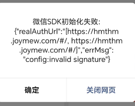
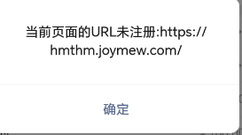

# 微信 H5 支付踩坑复盘：JSSDK 签名偶发失败与「URL 未注册」拦截

同一套代码，有时 `wx.config` 成功，有时却报 `config:invalid signature`。签名稳定后，支付又被微信弹窗拦截：**「当前页面的 URL 未注册」**。  
这次排障把两个问题都彻底收敛，下面整理成可复用的排查路径与修复清单。

## 现象一：`wx.config` 偶发 `config:invalid signature`

### 表现

- 打开 `https://hmthm.joymew.com/#/` 有时提示 `config:ok`，有时提示 `config:invalid signature`
- 同一条 URL、同一个 `appId`，后端 `/qianMing` 返回的签名参数每次都不同，但微信端校验**时好时坏**
- 右上角“刷新”多刷几次，更容易复现失败

### 签名机制回顾

`wx.config` 的校验本质是：

```text
signature == SHA1("jsapi_ticket=...&noncestr=...&timestamp=...&url=<当前页面URL(不含#)>")
```

URL 只要有一个字符不一致都会失败。但这次更诡异：**URL 看起来一致，仍然偶发失败**。

### 定位方向：不要只盯前端 URL

当 URL 逻辑自查无误却依旧偶发失败，重点应该转向后端签名票据是否稳定：

- `jsapi_ticket` 是否过期或刷新失败
- 是否存在多实例 / 负载均衡
- 各实例是否共享 ticket 缓存
- 刷新逻辑是否有并发保护

### 根因

**负载均衡 + ticket 缓存不一致**。

有的请求落到 A 节点，ticket 新鲜 → 签名可用；  
有的请求落到 B 节点，ticket 过期或刷新失败 → 签名不可用。  
表现就是同 URL 也会偶发 `invalid signature`。

### 修复动作（后端侧）

- ticket/access_token/jsapi_ticket 改为**共享缓存**（如 Redis），所有节点读同一份
- 刷新 ticket 做**单飞**（singleflight/分布式锁），避免并发刷新互相覆盖
- 刷新失败不要覆盖旧 ticket，保底沿用最后一次成功值
- 增加可观测性：记录参与签名的 URL、ticket 更新时间、ticket hash、实例标识

> 修复后：`wx.config` 不再偶发失败。

---

## 现象二：`chooseWXPay` 弹「当前页面的 URL 未注册」


签名稳定后继续走支付链路：

```text
submitOrder -> requestWxPay -> invokeWxSdk(wx.chooseWXPay)
```

### 表现

- 点击支付后，先出现微信支付 loading
- 随后弹窗：**当前页面的 URL 未注册：`https://hmthm.joymew.com/`**

这类弹窗经常被误认为“前端 alert”，但实际多半是微信支付侧的拦截提示。

### 根因

**商户号未配置支付目录**，或目录未命中。

微信 H5 支付要求“发起支付的页面 URL”必须落在商户平台配置的支付目录下，否则直接拦截并提示 URL 未注册。

### 修复动作（商户平台）

- 域名必须与实际发起支付页面一致（协议/域名/端口）
- 支付目录通常配置到站点根或业务目录，例如：`https://hmthm.joymew.com/`
- 不要带 query 参数
- 若存在多子域名或多套环境，需要分别配置
- 配置后有时会延迟生效，建议清理缓存并重新进入验证

> 配置支付目录后：`chooseWXPay` 不再被拦截。

---

## 容易被误导的点

### 1) `realAuthUrl` 为什么是数组？为什么带 `#`？

`wx.error` 有时会返回类似：

```json
{
  "realAuthUrl": ["https://hmthm.joymew.com/#/", "https://hmthm.joymew.com/#/"],
  "errMsg": "config:invalid signature"
}
```

这不是异常，通常只是微信侧的诊断信息：

- `realAuthUrl` 可能记录多次采样的 URL 候选，所以是数组
- 带 `#` 往往是展示用地址（如 `location.href`）
- 签名规则仍以**不含 `#`** 的 URL 为准

### 2) 为什么“右上角刷新”更容易触发？

刷新/重入会放大不稳定票据的影响：

- 页面被重新打开或重入
- URL 在内部被改写或附加参数（肉眼未必可见）
- 多实例 ticket 不一致时，刷新增加“落到错误节点”的概率

---

## 可复用排障 Checklist

### A. 排 `config:invalid signature`

1. 打印 `document.URL`、`location.href`、以及最终用于签名的 URL（去掉 `#`）
2. 对比成功/失败两次的 `url`、`appId`、`timestamp`、`nonceStr`、`signature`
3. 若 URL 完全一致仍偶发失败，优先怀疑 ticket 缓存或刷新不稳定
4. 服务端补充观测：ticket 更新时间、ticket hash、实例标识、参与签名 URL
5. 修复方向：共享缓存 + 单飞刷新 + 失败不覆盖

### B. 排「URL 未注册」支付失败

1. 这是支付侧拦截，不要只盯前端代码
2. 检查商户平台是否配置支付目录，且目录能命中真实页面
3. SPA/hash 路由场景下，支付目录仍按域名/路径匹配，根域名未配置会直接失败
4. 配置后重新进入验证，避免被旧 WebView 缓存影响

---

## 收尾

这次排障最后归结为两条结论：

- **签名稳定性是后端系统工程问题**：多实例与缓存策略不当，会把 `invalid signature` 变成随机灾难。
- **支付失败不等于签名失败**：`chooseWXPay` 的「URL 未注册」通常是商户侧配置问题。

如果你遇到“同 URL 偶发 invalid signature”或“支付 URL 未注册”，按上面的 checklist 走一遍，基本都能快速收敛。
